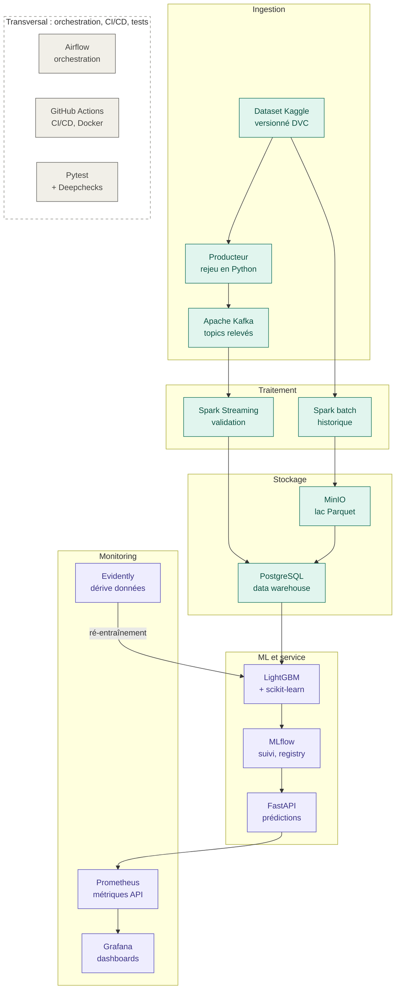

# GridPulse

**Comprendre, prévoir et mieux piloter la consommation d'électricité des foyers à partir de millions de relevés de compteurs intelligents.**

---

## 1. En bref

Chaque foyer équipé d'un compteur intelligent envoie un relevé de sa consommation d'électricité toutes les 30 minutes. À l'échelle d'une ville, cela représente des centaines de millions de mesures.

GridPulse transforme cette masse de données brutes, souvent incomplètes et désordonnées, en informations claires et utiles : combien les foyers vont consommer demain, quels types de comportements existent, et quels foyers sont prêts à modifier leurs habitudes quand l'électricité coûte plus cher.

## 2. Le problème

Un fournisseur d'électricité fait face à plusieurs difficultés :

- **Des données volumineuses et imparfaites** : relevés manquants, doublons, valeurs incohérentes, informations dispersées dans plusieurs fichiers.
- **Des prévisions peu précises**, qui compliquent la planification de la production et l'estimation des factures.
- **Une connaissance limitée des clients** : ils sont regroupés en grandes catégories, sans vision de leurs habitudes réelles.
- **Des offres tarifaires mal ciblées** : proposer un tarif variable à tout le monde coûte cher et n'intéresse pas tout le monde.

## 3. L'objectif

Mettre en place une chaîne complète de traitement des données, de la donnée brute jusqu'à l'information exploitable, afin de :

1. **Centraliser et nettoyer** les données de consommation, de météo et de calendrier, pour disposer d'une base fiable.
2. **Prévoir** la consommation des foyers pour le lendemain.
3. **Regrouper** les foyers qui ont des habitudes de consommation similaires.
4. **Identifier** les foyers les plus susceptibles de réduire leur consommation quand le prix de l'électricité est élevé.
5. **Rendre les résultats accessibles** sous forme de tableaux de bord et de service pour d'autres applications.
6. **Surveiller** les modèles dans le temps et les mettre à jour quand c'est nécessaire.

## 4. Les données

Le projet s'appuie sur un jeu de données public réel, issu du projet _Low Carbon London_ (UK Power Networks) et disponible sur Kaggle :

**Smart Meters in London**
https://www.kaggle.com/datasets/jeanmidev/smart-meters-in-london

|                              |                                                               |
| ---------------------------- | ------------------------------------------------------------- |
| Foyers suivis                | 5 567 foyers londoniens                                       |
| Période                      | Novembre 2011 à février 2014                                  |
| Fréquence                    | Un relevé toutes les 30 minutes                               |
| Volume                       | Environ 167 millions de lignes, soit environ 10 Go            |
| Informations complémentaires | Météo, jours fériés, catégorie socio-démographique des foyers |

Une partie des foyers (environ 1 100) a testé en 2013 un tarif variable, où le prix de l'électricité change selon les moments de la journée. Les autres (environ 4 500) sont restés à un prix fixe. Cette différence permet d'étudier comment les habitudes changent quand le prix change.

### Fichiers et colonnes principales

| Fichier                                      | Contenu                                                         | Colonnes principales                                                                          |
| -------------------------------------------- | --------------------------------------------------------------- | --------------------------------------------------------------------------------------------- |
| Relevés demi-horaires (`halfhourly_dataset`) | Une ligne par foyer et par demi-heure                           | `LCLid` (foyer), `tstp` (date et heure), `energy(kWh/hh)` (kWh sur 30 min)                    |
| Agrégats journaliers (`daily_dataset`)       | Somme, moyenne, max, min, médiane et nombre de relevés par jour | `LCLid` (foyer), jour, statistiques de consommation de la journée                             |
| Journées en colonnes (`hhblock_dataset`)     | Une journée par ligne                                           | 48 colonnes, une par demi-heure                                                               |
| Foyers (`informations_households`)           | Description de chaque foyer                                     | `LCLid`, `stdorToU` (tarif fixe ou dynamique), `Acorn` (groupe), `file` (bloc de ses relevés) |
| Groupes ACORN (`acorn_details`)              | Profil de population de chaque groupe                           | Description socio-démographique                                                               |
| Météo (horaire et journalière)               | Conditions météo                                                | `temperature`, `humidity`, `windSpeed`, `icon`, `summary`, `precipType`                       |
| Jours fériés (`uk_bank_holidays`)            | Jours fériés britanniques                                       | `date`, `type`                                                                                |

## 5. Ce que fait le projet

1. **Collecter et ranger** les données dans un lac de données et un entrepôt de données.
2. **Explorer** les données (analyse exploratoire) pour comprendre leurs forces et leurs défauts.
3. **Nettoyer et préparer** les données avec Spark : valeurs manquantes, doublons, valeurs anormales.
4. **Transformer** les données : croisements entre fichiers, calculs agrégés et création des variables utiles à l'apprentissage automatique.
5. **Simuler l'arrivée de nouvelles données chaque jour** avec Kafka et Spark Streaming, pour que les modèles puissent prédire la consommation de demain.
6. **Entraîner et comparer des modèles** pour trois tâches de Machine Learning.
7. **Servir les résultats** par une API et des tableaux de bord, **surveiller** les modèles et les **ré-entraîner** si besoin.

## 6. Architecture

Légende des couleurs : vert pour les données (ingestion, traitement, stockage), violet pour le Machine Learning et le monitoring, gris pour les outils transversaux.

Le projet suit un parcours en cinq étapes, du fichier brut jusqu'à la surveillance des résultats, complétées par des outils qui servent à toutes les étapes.

| Étape         | Rôle                                                                     | Outils                                                             |
| ------------- | ------------------------------------------------------------------------ | ------------------------------------------------------------------ |
| Ingestion     | Récupérer le jeu de données et simuler l'arrivée de nouveaux relevés     | Dataset Kaggle versionné avec DVC, producteur Python, Apache Kafka |
| Traitement    | Nettoyer et préparer les données, en historique et en continu            | Spark batch, Spark Streaming                                       |
| Stockage      | Conserver les données brutes et les données prêtes à analyser            | MinIO (lac Parquet), PostgreSQL (entrepôt de données)              |
| ML et service | Entraîner, suivre et publier les modèles                                 | LightGBM, scikit-learn, MLflow, FastAPI                            |
| Monitoring    | Suivre l'API, afficher les indicateurs et détecter la dérive des données | Prometheus, Grafana, Evidently                                     |
| Transversal   | Orchestrer, automatiser et tester                                        | Airflow, GitHub Actions, Pytest, Deepchecks                        |

Quand Evidently détecte une dérive importante des données, un nouvel entraînement des modèles est déclenché : c'est la boucle de ré-entraînement visible sur le schéma.

## 7. Les trois questions auxquelles le projet répond

| Question                                                               | Intérêt                                                                 |
| ---------------------------------------------------------------------- | ----------------------------------------------------------------------- |
| **Combien un foyer va-t-il consommer demain ?**                        | Mieux planifier la production d'énergie et estimer des factures justes  |
| **Quels types de foyers existent, selon leurs habitudes ?**            | Proposer des offres adaptées à chaque type de comportement              |
| **Quels foyers réduiraient leur consommation si le prix augmentait ?** | Ne contacter que les foyers réellement intéressés par un tarif variable |

## 8. À qui s'adresse le projet

- **Les analystes de l'énergie**, pour anticiper la demande.
- **Les équipes marketing et tarification**, pour cibler leurs offres.
- **Le service client et la facturation**, pour estimer et vérifier les consommations.
- **Les équipes techniques**, pour suivre la santé des données et des résultats.

## 9. Résultats attendus

- Des données propres, centralisées et documentées.
- Des prévisions de consommation plus fiables qu'une simple estimation de base.
- Des groupes de foyers compréhensibles et exploitables par des non-spécialistes.
- Une liste priorisée de foyers à cibler pour une offre de tarification variable.
- Un suivi permanent de la qualité, avec alertes en cas de dérive.

## 10. Pourquoi ce projet est intéressant

- Il repose sur des **données réelles et volumineuses**, avec les défauts que l'on rencontre en entreprise.
- Il couvre **toute la chaîne** : de la donnée brute jusqu'à la décision, en passant par le nettoyage, la modélisation et la surveillance.
- Il répond à un **besoin concret** : mieux comprendre et piloter la consommation d'électricité, un enjeu à la fois économique et environnemental.
